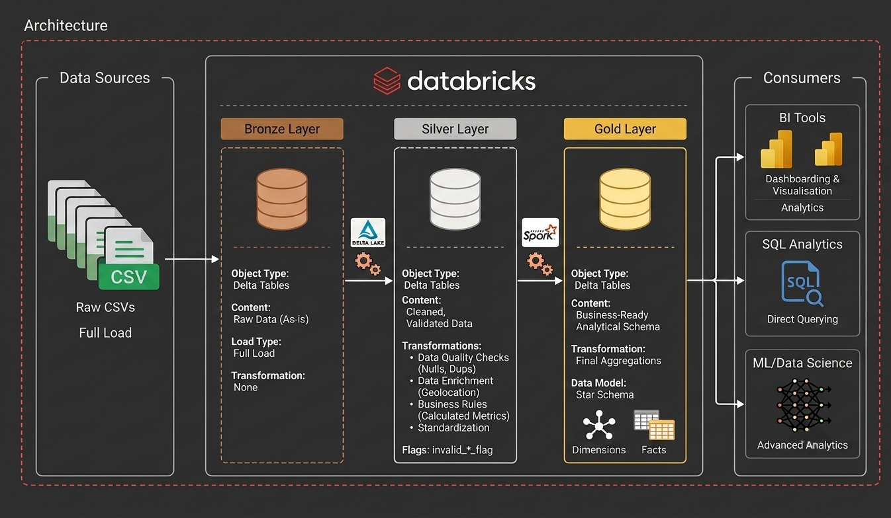
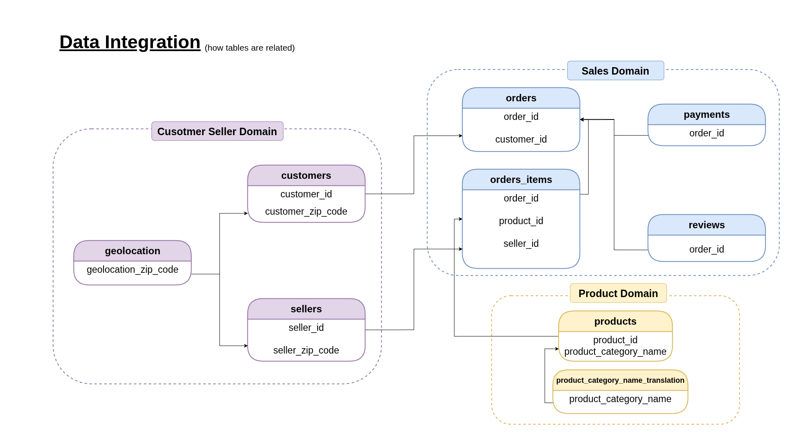
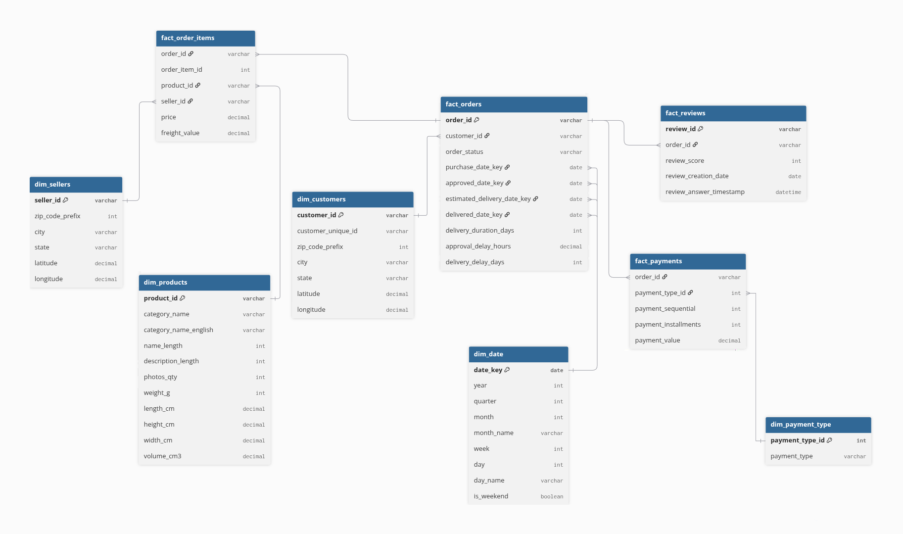

# E-commerce Data Pipeline on Databricks

[](https://databricks.com)
[](https://spark.apache.org)
[](https://spark.apache.org/docs/latest/api/python/)
[](https://delta.io)
[](https://www.python.org)
[](https://databricks.com)
[](https://git-scm.com)

An end-to-end Medallion Architecture (Bronze → Silver → Gold) data pipeline built on **Databricks** using **PySpark** and **Delta Lake**, transforming the Brazilian E-commerce Public Dataset by **Olist** into a query-ready analytical star schema.

---

## Overview

This project implements a complete **Medallion Architecture** data pipeline on the Databricks Lakehouse Platform. Raw CSV files are ingested, cleaned, validated, and modeled into a dimensional star schema ready for BI and analytics.

The pipeline processes the **[Brazilian E-commerce Public Dataset by Olist](https://www.kaggle.com/datasets/olistbr/brazilian-ecommerce)**, a real-world dataset containing ~100,000 orders placed on the Olist marketplace across Brazil. It covers the full analytical journey:

- **Bronze Layer** — raw data landing and preservation as Delta tables.
- **Silver Layer** — data cleaning, validation, quality flags, and business rule calculations.
- **Gold Layer** — a dimensional star schema optimized for analytical queries.

The final Gold layer can be consumed directly by tools such as Power BI, Tableau, or SQL analytics, enabling questions like *"How does delivery time vary by state?"* or *"Which product categories generate the most revenue?"*

---

## Architecture

The project follows the **Medallion Architecture**, a data design pattern used to progressively improve data quality as it flows through a lakehouse:

| Layer | Purpose |
| --- | --- |
| **Bronze** | Ingests raw CSV files and stores them *as-is* in Delta tables. Serves as a point-in-time snapshot of the source data. |
| **Silver** | Cleans, standardizes, validates, and enriches the data. Applies business rules, removes duplicates, handles nulls, and flags invalid records. |
| **Gold** | Models the cleaned data into business-level dimensions and facts (star schema) for reporting and analytics. |



This layered approach brings several key benefits:

- **Reproducibility** — raw data is never modified; transformations are always re-runnable.
- **Traceability** — each layer is stored as Delta tables, enabling `TIME TRAVEL` for auditing and debugging.
- **Scalability** — all processing runs distributed on Spark and scales horizontally.
- **Separation of concerns** — data engineers own Silver, analysts own Gold.

---

## Dataset Overview

The **Brazilian E-commerce Public Dataset by Olist** is a publicly available dataset of real order data collected from the Olist marketplace (2016–2018). It contains ~100,000 orders, ~3,000 sellers, and ~32,000 products, distributed across all Brazilian states.

The dataset is delivered as **9 CSV files** describing a relational model of the business:

| File | Description |
| --- | --- |
| `customers.csv` | Customer data (ID, unique ID, zip code, city, state) |
| `geolocation.csv` | Geolocation of Brazilian zip codes (lat/lng, city, state) |
| `order_items.csv` | Items within each order (product, seller, price, freight) |
| `orders.csv` | Order lifecycle data (purchase, approval, delivery timestamps) |
| `payments.csv` | Payment transactions per order |
| `product_category_name_translation.csv` | Portuguese to English category names |
| `products.csv` | Product attributes (category, dimensions, weight) |
| `reviews.csv` | Customer reviews (score, comments, timestamps) |
| `sellers.csv` | Seller data (ID, zip code, city, state) |

**The business problem:** the raw CSVs are denormalized, contain inconsistencies (null keys, invalid references, out-of-range coordinates), and are not in a shape suitable for efficient analytics. The goal is to build a reliable, validated, and well-modeled dataset that answers operational and commercial questions.

---

## Data Integration

Source tables are grouped into **business domains**. Each domain represents a coherent area of the business and is processed consistently across the pipeline:


- **Customer Seller Domain**
  - `customers`
  - `sellers`
  - `geolocation`

- **Product Domain**
  - `products`
  - `product_category_name_translation`

- **Sales Domain**
  - `orders`
  - `order_items`
  - `payments`
  - `reviews`



Grouping tables into domains keeps the pipeline modular, makes cross-domain dependencies explicit (e.g., customers are validated against geolocation zip codes), and simplifies maintenance.

---

## Bronze Layer

The **Bronze layer** is the ingestion stage. It reads the 9 raw CSV files from a source directory and persists them as Delta tables, preserving the data in its original, unprocessed form.

The ingestion module (`src/bronze/ingestion.py`) performs:

- **CSV ingestion** — reads every source file with a shared, configurable reader.
- **Schema inference** — automatically infers column types from the CSV data.
- **Raw data preservation** — no transformations are applied; the data is stored exactly as received.
- **Delta tables** — each file is written as a Delta table (`ecommerce.bronze.<table_name>`), enabling ACID transactions and time travel.

Bronze serves as the **single source of truth** for the original data and can always be re-processed downstream.

---

## Silver Layer

The **Silver layer** cleans, validates, and enriches the Bronze tables. It produces consistent, high-quality datasets that are the foundation for analytics.

Each Silver transformation (`src/silver/*.py`) applies a combination of:

- **Data cleaning** — trimming whitespace, standardizing text case.
- **Null handling** — dropping records with null primary keys and imputing missing attributes.
- **Duplicate removal** — removing exact and key-based duplicate records.
- **Data validation** — checking values against reference data and domain rules.
- **Data quality flags** — flagging suspect records instead of silently deleting them, e.g.:
  - `invalid_zip_code_flag` — customer/seller zip code not found in geolocation reference
  - `invalid_order_id_flag` — order reference not found in the orders table
  - `invalid_product_id_flag` — product reference not found in the products table
  - `invalid_seller_id_flag` — seller reference not found in the sellers table
- **Business rule calculations** — computing derived metrics from raw columns.
- **Standardization** — consistent formatting of cities, states, and categories.
- **Enrichment** — joining reference data (e.g., geolocation, category translation) into domain tables.

Every Silver table also receives metadata columns (`processed_time`, `source`) for traceability.

---

## Gold Layer

The **Gold layer** builds a **Star Schema**, the standard dimensional model for business analytics. Facts hold quantitative measures and reference dimensions, while dimensions provide descriptive context.



### Dimensions

| Dimension | Content |
| --- | --- |
| `dim_customers` | Customer attributes enriched with geolocation (city, state, lat/lng) |
| `dim_products` | Product attributes enriched with English category names and computed volume |
| `dim_sellers` | Seller attributes enriched with geolocation |
| `dim_payment_type` | Surrogate-key dimension of payment methods |
| `dim_date` | Date dimension covering 2010–2026 with year, quarter, month, week, day, and weekend flags |

### Facts

| Fact | Content |
| --- | --- |
| `fact_orders` | Order-level metrics: purchase/approved/delivered date keys, delivery duration, approval delay, delivery delay |
| `fact_order_items` | Item-level metrics: price, freight value, linked to product and seller dimensions |
| `fact_payments` | Payment-level metrics: payment type key, installments, payment value |
| `fact_reviews` | Review-level metrics: review score, creation date, answer timestamp |

Only **validated records** (quality flags equal to 0) are promoted into the facts, guaranteeing the integrity of downstream reporting.

---

## Project Structure

```
src/
├── bronze/
│   └── ingestion.py
├── silver/
│   ├── customers.py
│   ├── geolocation.py
│   ├── order_items.py
│   ├── orders.py
│   ├── payments.py
│   ├── product_category_name_translation.py
│   ├── products.py
│   ├── reviews.py
│   └── sellers.py
├── gold/
│   ├── dimensions/
│   └── facts/
├── notebooks/
│   ├── bronze.ipynb
│   ├── silver.ipynb
│   └── gold.ipynb
└── config.py
```

`src/config.py` centralizes the raw data path and the source-to-table mapping, so the pipeline configuration lives in one place.

---

## Technologies

| Technology | Role |
| --- | --- |
| **Python** | Primary programming language for pipeline logic |
| **PySpark** | Distributed data processing engine |
| **Delta Lake** | ACID storage layer for all Bronze, Silver, and Gold tables |
| **Databricks** | Lakehouse platform providing compute, notebooks, and orchestration |
| **SQL** | Querying and validating the modeled Gold layer |
| **Git** | Version control for the pipeline codebase |

---

## Pipeline Execution

The pipeline runs in **three sequential stages**, one per layer:

```
Bronze Notebook
      ↓
Silver Notebook
      ↓
Gold Notebook
```

1. **Bronze Notebook** (`src/notebooks/bronze.ipynb`) — ingests raw CSVs into Bronze Delta tables.
2. **Silver Notebook** (`src/notebooks/silver.ipynb`) — applies all cleaning and validation transformations.
3. **Gold Notebook** (`src/notebooks/gold.ipynb`) — builds dimensions and facts for the star schema.

Each notebook imports the corresponding modules from `src/` and executes them against the Databricks Spark session. In production, these notebooks are **orchestrated using Databricks Workflows (Jobs)**, where each notebook is a task and the workflow enforces the correct execution order.

---

## Data Quality

The pipeline embeds data quality checks at every stage:

- **Null validation** — records with null primary keys (`order_id`, `customer_id`, `seller_id`, `product_id`, `review_id`) are removed; missing product dimensions are imputed.
- **Duplicate removal** — exact duplicates and key-based duplicates are eliminated.
- **Foreign key validation** — references such as `order_id`, `product_id`, and `seller_id` are validated against their parent tables and flagged with `invalid_*_flag` columns.
- **Missing date validation** — orders missing expected lifecycle dates (approval, carrier delivery, customer delivery) are flagged via `missing_*_flag` columns.
- **Missing dimension handling** — unmapped categories and zip codes are flagged; missing product measurements default to zero.
- **Invalid reference flags** — each quality flag is a binary column (`0`/`1`) that marks suspect records without deleting them, preserving full traceability.
- **Derived metrics** — calculated business rules (e.g., delivery duration) are validated through type conversion and null-safe arithmetic.

Only records passing all quality gates are promoted to the Gold layer.

---

## Business Metrics

The pipeline computes several business metrics directly in the Silver layer:

| Metric | Definition |
| --- | --- |
| **Delivery Duration** | Days between purchase and customer delivery |
| **Approval Delay** | Hours between purchase and order approval |
| **Delivery Delay** | Days between actual and estimated delivery (negative = early) |
| **Product Volume** | Physical product volume in cm³ (`length × height × width`) |

These metrics are carried into the Gold facts, enabling out-of-the-box analytical queries.

---

## Future Improvements

Planned enhancements for the pipeline:

- **Incremental loading** — process only new or changed data instead of full overwrites.
- **Change Data Capture (CDC)** — capture and apply upstream changes to keep Delta tables in sync.
- **Delta Live Tables** — declarative, managed pipelines with built-in expectations and quality checks.
- **Unity Catalog** — centralized governance, lineage, and access control for all tables.
- **Great Expectations** — automated, reusable data quality suites.
- **CI/CD** — automated testing and deployment of pipeline code.
- **Power BI Dashboard** — build a live dashboard on top of the Gold layer.
- **Monitoring & Alerting** — track pipeline health, failures, and data quality drift.

---

## Getting Started

Run the notebooks **in order** inside a Databricks workspace with an attached cluster (the bronze notebook must finish before Silver starts, and so on):

1. **Bronze** — open and run `src/notebooks/bronze.ipynb` to ingest the raw CSVs into Bronze Delta tables.
2. **Silver** — open and run `src/notebooks/silver.ipynb` to clean, validate, and enrich the data.
3. **Gold** — open and run `src/notebooks/gold.ipynb` to build the star schema dimensions and facts.

**Prerequisites:**

- A Databricks workspace with a running cluster (PySpark runtime).
- The raw Olist CSV files placed at the path configured in `src/config.py` (`RAW_PATH`).
- The schema `ecommerce` created in the catalog before the first run.

After the Gold notebook completes, query the `ecommerce.gold.*` tables directly with SQL:

```sql
SELECT c.state,
       ROUND(AVG(o.delivery_duration_days), 1) AS avg_delivery_days
FROM ecommerce.gold.fact_orders o
JOIN ecommerce.gold.dim_customers c
  ON o.customer_id = c.customer_id
GROUP BY c.state
ORDER BY avg_delivery_days DESC;
```

---

## Author

**Zain** — Data Engineer.

This project was built to demonstrate an end-to-end lakehouse pipeline using the Medallion Architecture, PySpark, and Delta Lake on Databricks.

---

**License:** This project is for educational purposes. The Olist dataset is licensed under the CC BY-NC-SA 4.0 license.
